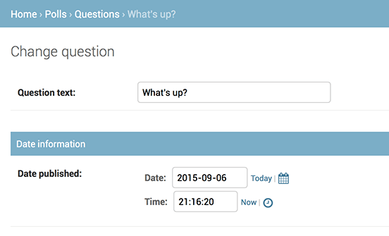
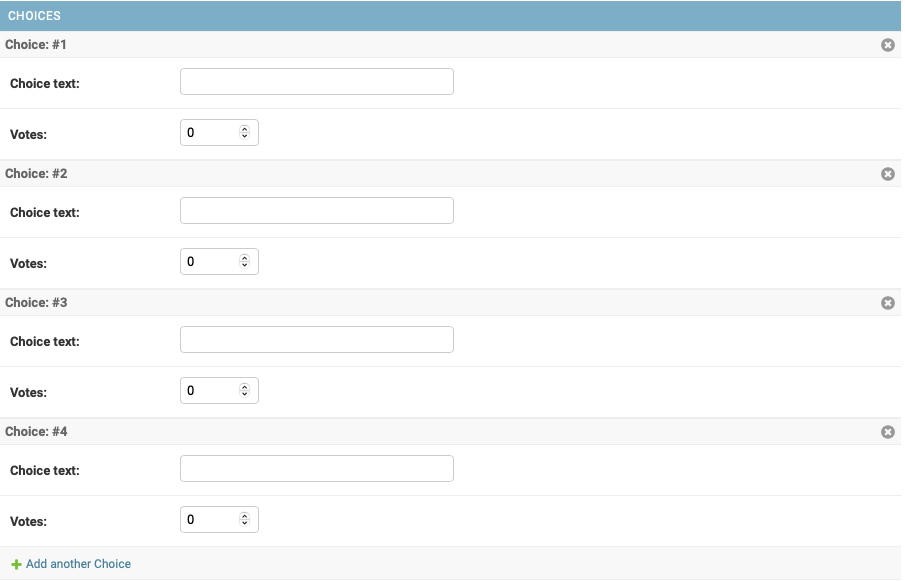
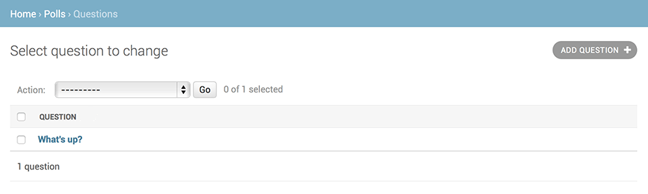
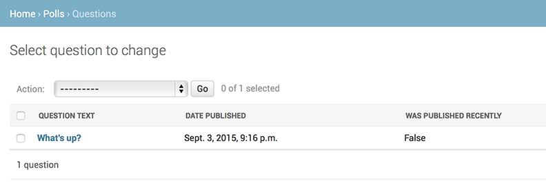

# Tutorial

## Index
- [1. Requests and Responses](#1-requests-and-responses)
  - [파일 구조](#파일-구조)
  - [개발 서버](#개발-서버)
  - [앱 생성](#앱-생성)
  - [path() 함수](#path-함수)
- [2. Models and the Admin site](#2-models-and-the-admin-site)
  - [DB 연동](#db-연동)
  - [INSTALLED_APPS](#installed_apps)
  - [Model](#model)
    - [모델의 활성화](#모델의-활성화)
    - [요약](#요약)
  - [API](#api)
  - [Django 관리자](#django-관리자)
- [3. Views and Templates](#3-views-and-templates)
  - [View](#view)
  - [Template](#template)
  - [404 error](#404-error)
  - [Template 사용하기](#template-사용하기)
  - [이름 공간](#이름-공간)
- [4. Forms and generic views](#4-forms-and-generic-views)
  - [Form 예시](#form-예시)
  - [View 예시](#view-예시)
  - [Generic View](#generic-view)
    - [1. URLconf 수정](#1-urlconf-수정)
    - [2. View 수정](#2-view-수정)
      - [DetailView](#detailview)
      - [ListView](#listview)
- [5. Testing](#5-testing)
  - [테스트 작성](#테스트-작성)
  - [Django test client](#django-test-client)
    - [Shell에서 사용하기](#shell에서-사용하기)
- [6. Static files](#6-static-files)
- [7. Customizing the admin site](#7-customizing-the-admin-site)
- [8. Adding third party packages](#8-adding-third-party-packages)

---

## 1. Requests and Responses

```shell
$ django-admin startproject $(project_name)
```

> 프로젝트 이름으로 Python, Django에서 사용 중인 이름은 피해야 한다. (예: test, django, ...)

### 파일 구조

```shell
$(project_name)/
    manage.py
    $(project_name)/
        __init__.py
        settings.py
        urls.py
        wsgi.py
```

- `manage.py`: Django 프로젝트와 다양한 방법으로 상호작용할 수 있는 커맨드라인 유틸리티
- `$(project_name)/`: 프로젝트 디렉토리
    - `__init__.py`: Python 패키지로 인식되도록 하는 빈 파일
    - `settings.py`: 프로젝트 설정
    - `urls.py`: URL 선언
    - `wsgi.py`: WSGI 호환 웹 서버 진입점

### 개발 서버

```shell
$ python manage.py migrate
$ python manage.py runserver $(ip:port)
```

- migrate는 데이터베이스에 모델을 생성한다.
- port를 생략하면 기본값인 8000번 포트로 실행된다.

### 앱 생성

```shell
$ python manage.py startapp $(app_name)
```

- `$(app_name)/`: 앱 디렉토리
    - `__init__.py`: Python 패키지로 인식되도록 하는 빈 파일
    - `admin.py`: 관리자 페이지 설정
    - `apps.py`: 앱 설정
    - `migrations/`
        - `__init__.py`: 마이그레이션 파일
    - `models.py`: 데이터베이스 모델
    - `tests.py`: 테스트 코드
    - `views.py`: 뷰 코드

> ### include() 함수
>
> 다른 URLconf를 참조할 때 사용한다. `include()` 함수는 다른 URLconf의 일부를 가져와서, 해당 요청이 그 URLconf의 일부를 처리하도록 한다.
> 즉, URLconf가 polls/urls.py라면, /polls/, /fun_polls/, /content/polls/ 등으로 시작하는 URL은 모두 polls/urls.py로 전달된다.

### path() 함수

```python
path('polls/', include('polls.urls'))
```

- path() 함수는 총 네 개의 인수를 받는다.
    - route
        - URL 패턴을 가진 문자열
        - 첫 번째 패턴부터 시작하여, 일치하는 패턴을 찾을 때까지 요청된 URL을 각 패턴과 리스트의 순서대로 비교한다.
    - view
        - URL 패턴이 일치할 때 호출될 뷰 함수
        - HttpRequest 객체를 첫 번째 인수로 받고, 경로로부터 'route'로 추출된 값들을 키워드 인수로 받는다.
    - kwargs
        - 임의의 키워드 인수를 view에 사정형으로 전달한다.
    - name
        - URL 패턴의 이름을 지정한다.

---

## 2. Models and the Admin site

### DB 연동

- 기본적으로 sqlite3 db가 연동되어 있다.
- db 설정을 바꾸려면 `setting.py` 에 들어가서 `DATABASES` 값을 바꿔야 한다.

```python
DATABASES = {
    "default": {
        "ENGINE": "django.db.backends.sqlite3",
        "NAME": BASE_DIR / "db.sqlite3",
    }
}
```

- `ENGINE` : 연결 할 database
- `NAME` : database의 이름

- SQLite를 사용하지 않는 경우, `USER` , `PASSWORD` , `HOST`
  같은 [추가 설정](https://docs.djangoproject.com/ko/5.0/ref/settings/#std-setting-DATABASES)이 반드시 필요하다.
- 또한 이 시점에서 database를 생성히고 `setting.py` 에 설정된 사용자가 권한이 있는지 확인해야 한다.

- 아래와 같이 언어와 시간도 설정할 수 있다.

```python
LANGUAGE_CODE = "ko-kr"  # 한글
TIME_ZONE = "Asia/Seoul"  # 한국 시간
```

### INSTALLED_APPS

- 장고 설치에서 활성화된 모든 앱을 지정하는 목록
- 기본적으론 아래와 같은 앱들이 있고 직접 추가할 수도 있다.
    - `django.contrib.admin` : 관리용 사이트
    - `django.contrib.auth` : 인승 시스템
    - `django.contrib.contenttypes` : 컨텐츠 타입을 위한 프레임워크
    - `django.contrib.sessions` : 세션 프레임워크
    - `django.contrib.messages` : 메세징 프레임워크
    - `django.contrib.staticfiles` : 정적 파일을 관리하는 프레임워크
- 기본 어플리케이션 중 몇몇은 데이터베이스를 사용하기에 미리 설정해주어야 한다.

- `migrate` 명령으로 `INSTALLED_APPS` 설정을 탐색하고 `settings.py` 에 있는 다양한 설정을 토대로 필요한 데이터베이스 테이블을 생성한다.

```shell
$ python manage.py migrate
```

- 어떤 테이블이 생겼는지 궁금하다면 각 명령어로 확인할 수 있다.
    - \dt(PostgreSQL), SHOW TABLES; (MariaDB, MySQL), .tables (SQLite), SELECT TABLE_NAME FROM USER_TABLES; (Oracle)

- 만약 기본 앱 중 필요하지 않다면 주석 혹은 삭제하고 `migrate` 명령을 실행하면 된다.

### Model

- 모델이란 부가적인 메타데이터를 가진 데이터베이스의 구조(layout)를 말한다.
- 각 모델은 `django.db.models.Model` 의 파생 클래스로 표현 되며 클래스 변수는 각 모델의 데이터베이스 필드를 나타낸다.
- 데이터베이스의 각 필드는 `Field` 클래스의 인스턴스로 표현되며 종류는 아래와 같다.

|    Field 이름     |                      설명                      |
|:---------------:|:--------------------------------------------:|
|    CharField    |  문자열을 저장하는 필드, 최대 길이(max_length)를 설정할 수 있다.  |
|    TextField    |          긴 텍스트를 저장하는 필드, 길이 제한이 없다.          |
|  IntegerField   |                 정수를 저장하는 필드                  |
|   FloatField    |              부동 소수점 수를 저장하는 필드               |
|  DecimalField   |              고정 소수점 수를 저장하는 필드               |
|  BooleanField   |            True, False 값을 저장하는 필드            |
|    DateField    |                 날짜를 저장하는 필드                  |
|  DateTimeField  |               날짜와 시간을 저장하는 필드                |
|    TimeField    |                 시간을 저장하는 필드                  |
|   EmailField    |               이메일 주소를 저장하는 필드                |
|    FileField    |                 파일을 업로드하는 필드                 |
|   ImageField    |               이미지 파일을 업로드하는 필드               |
| ForeignKeyField |             다른 모델과의 관계를 나타내는 필드              |
| ManyToManyField |               다대다 관계를 나태내는 필드                |
|  OneToOneField  |               일대일 관계를 나타내는 필드                |
|    SlugField    | URL에서 사용될 수 있는 문자열을 저장하는 필드, 보통 제목이나 이름에 사용  |
|    URLField     |                 URL을 저장하는 필드                 |
| IPAddressField  |                IP주소를 저장하는 필드                 |
|    UUIDField    | UUID(Universally Unique Identifier)를 저장하는 필드 |
|   BinaryField   |               이진 데이터를 저장하는 필드                |
|  DurationField  |                시간 간격을 저장하는 필드                |

```python
from django.db import models


class Question(models.Model):
    question_text = models.CharField(max_length=200)
    pub_date = models.DateTimeField("date published")


class Choice(models.Model):
    question = models.ForeignKey(Question, on_delete=models.CASCADE)
    choice_text = models.CharField(max_length=200)
    votes = models.IntegerField(default=0)

```

- `pub_date` 처럼 첫번째 인자로 이름을 지정할 수도 있다. 지정하지 않는다면 컴퓨터가 읽기 쉬운 것으로 임의 지정한다.
- `default` 인수로 기본값을 정의하거나 각 필드에 있는 옵션을 통해 설정을 추가할 수 있다.
- `ForeignKey` 를 통해 각각의 Choice 가 하나의 Question 에 관계된다는 것을 장고에게 알려준다.

#### 모델의 활성화

- 위처럼 모델을 정의하는 것으로 이 앱을 위한 데이터베이스 스키마 생성(CREATE TABLE 문), 각 객체에 접근하기 위한 Python 데이터베이스 접근 API 생성 등의 동작이 수행된다.
- 그러나 가장 먼저 위 앱이 설치되었다는 것을 `settings.py` 에 알려주어야 한다.

```python
INSTALLED_APPS = [
    "polls.apps.PollsConfig",
    ...
]
```

- 위와 같이 앱의 구성을 추가한 뒤 아래의 명령을 실행하면 장고가 모델을 변경시킨 사실과 이 사항을 migration으로 저장시키고 싶다는 것을 알게 된다.

```shell
$ python manage.py makemigrations $(app_name)
```

- Migration은 Django가 모델의 변경사항을 디스크에 저장하는 방법이다. `$(app_name)/migrations/0001_initial.py` 파일에서 직접 확인할 수도 있다.

```shell
$ python manage.py sqlmigrate polls 0001
``` 

- 위 명령어로 실행되는 SQL 문장을 직접 볼 수도 있다.
- 그 외 참고사항
    - 사용하는 데이터베이스의 따라서 출력 결과는 다를 수 있다.
    - 테이블 이름은 앱 이름 + 모델 이름(소문자)이 조합되어 자동으로 생성된다. (override하여 다른 동작 가능)
    - 기본 키(ID)가 자동으로 추가된다. (override하여 다른 동작 가능)
    - 관례에 따라 장고는 외래 키 필드명에 `_id` 이름을 자동으로 추가한다. (override하여 다른 동작 가능)
    - 외래 키 관계는 `FOREIGN KEY` 라는 제약에 의해 명시된다. `DEFERRABLE` 부분은 PostgreSQL에 트랜잭션이 끝날 때까지 외래 키를 강제하지 말라고 알려주는 것 뿐이다.
    - 사용하는 데이터베이스에 따라 데이터베이스 고유의 필드타입이 조정된다.
    - `sqlmigrate` 명령은 실제로 데이터베이스에서 마이그레이션을 실행하지 않고 확인만 할 수 있게 도와준다.
    - `python manage.py check` 를 통해 마이그레이션을 수행하거나 데이터베이스를 건드리지 않고 프로젝트의 문제를 확인할 수 있다.

```shell
$ python manage.py migrate
```

- 이제 `migrate` 명령을 통해 아직 적용되지 않은 마이그레이션을 모두 수집해 이를 실행한다. (이때 django는 **django_migrations** 테이블을 두어 마이그레이션 적용 여부를 확인한다.)
- 마이그레이션 기능은 동작 중인 데이터베이스를 자료 손실 없이 업그레이드 하는 데 최적화 되어 있다.

#### 요약

1. `models.py` 에서 모델을 변경
2. `python manage.py makemigrations` 명령으로 변경사항에 대한 마이그레이션 생성
3. `python manage.py migrate` 명령으로 변경사항을 데이터베이스에 적용

### API

```python
from django.db import models


class Question(models.Model):
    # ...
    def __str__(self):
        return self.question_text


class Choice(models.Model):
    # ...
    def __str__(self):
        return self.choice_text
```

- `__str__` 메소드로 객체의 표현을 편하게 볼 수 있다. 또한 장고가 자동으로 생성하는 관리 사이트에서도 객체의 표현이 사용되기에 사용하는 것이 좋다.
- 그 외 [모델의 관계에 대한 더 많은 정보](https://docs.djangoproject.com/ko/5.0/ref/models/relations/)
  나 [API 관련 정보](https://docs.djangoproject.com/ko/5.0/topics/db/queries/) 들도 있다.

### Django 관리자

- 장고는 모델에 대한 관리용 인터페이스를 모두 자동으로 생성한다.
- 관리자 생성은 아래와 같이 할 수 있다.

```shell
$ python manage.py createsuperuser
```

- 관리자 사이트는 `로컬 도메인 + /admin/` 으로 접근할 수 있다.
- 편집 가능한 그룹과 사용자와 같은 몇 종류의 컨텐츠를 확인할 수 있으며 이는 `django.contrib.auth` 모듈에서 제공된다.

- 만약 내가 만든 앱도 관리 페이지에서 확인하려면 `$(app_name)/admin.py` 에 다음과 같이 추가해야 한다.

```python
from django.contrib import admin

from .models import Question

admin.site.register(Question)
```

---

## 3. Views and Templates

### View

- view는 일반적으로 특정한 기능을 제공하고 특정한 템플릿을 가진 장고 앱에 있는 웹 페이지의 type이다.
- 장고에서는 웹 페이지와 기타 콘텐츠가 view로 전달된다.
- 각 view는 파이썬 함수로 표현된다.
- URL로 부터 view를 얻기 위해 장고는 `URLconfs` 를 사용한다.

```python
def detail(request, question_id):
    return HttpResponse("You're looking at question %s." % question_id)


def results(request, question_id):
    response = "You're looking at the results of question %s."
    return HttpResponse(response % question_id)


def vote(request, question_id):
    return HttpResponse("You're voting on question %s." % question_id)
```

- 위와 같이 `$(app_name)/views.py` 파일에 view를 추가할 수 있으며 위 view들은 인수를 받기 때문에 모양이 조금 다르다.

```python
urlpatterns = [
    # ex: /polls/
    path("", views.index, name="index"),
    # ex: /polls/5/
    path("<int:question_id>/", views.detail, name="detail"),
    # ex: /polls/5/results/
    path("<int:question_id>/results/", views.results, name="results"),
    # ex: /polls/5/vote/
    path("<int:question_id>/vote/", views.vote, name="vote"),
]
```

- 그리도 `$(app_name)/urls.py` 에 새로운 view를 연결해주어야 한다.
- 만약 "/polls/34" 를 요청한다면 아래와 같은 동작으로 처리된다.
    1. 장고는 `ROOT_URLCONF` 설정이 가리키고 있는 `$(project_name).urls` python 모듈을 로드한다.
    2. 이 모듈은 `urlpatterns` 에 `$(app_name)/` 을 찾아 패턴을 순서대로 이동한다.
    3. 찾았다면 `$(app_name)` 을 제거하고 나머지 텍스트인 `34/` 를 추가 처리하기 위해 `$(app_name).urls` URLconf로 보낸다.
    4. 거기서 일치하는 패턴을 찾아 `detail(request=<HttpRequest object>, question_id=34)` 와 같은 `detail()` view를 호출한다.
    5. 이때 **question_id=34** 는 **<int:question_id>** 에서 왔다.

- 각 view는 요청된 페이지의 내용이 담긴 HttpResponse 객체를 반환하거나 Http404 같은 예외를 발생하게 해야 한다.

### Template

- 만약 `index()` view를 하나 만들었다고 가정했을 때 디자인이 하드코딩 되어 있다면 코드를 계속 편집해야 한다.
- 이러한 상황을 방지하기 위해 **template** 을 사용한다.

```python
TEMPLATES = [
    {
        "BACKEND": "django.template.backends.django.DjangoTemplates",
        "DIRS": [],
        "APP_DIRS": True,
        "OPTIONS": {
            "context_processors": [
                "django.template.context_processors.debug",
                "django.template.context_processors.request",
                "django.contrib.auth.context_processors.auth",
                "django.contrib.messages.context_processors.messages",
            ],
        },
    },
]
```

- 위 코드와 같이 `settings.py` 에서 장고가 템플릿을 어떻게 불러오고 렌더링 할 것인지 기술한다.
- 기본 설정은 다음과 같다.
    - `APP_DIRS` 가 True 로 `DjangoTemplates` 백엔드를 구성한다.
    - 관례에 따라 `DjangoTemplates` 는 `INSTALLED_APPS` 폴더의 하위 디렉토리인 `templates` 를 탐색한다.
    - 즉 `$(app_name)/templates/$(app_name)` 경로에서 템플릿을 찾는다.

```python
from django.http import HttpResponse
from django.template import loader

from .models import Question


def index(request):
    latest_question_list = Question.objects.order_by("-pub_date")[:5]
    template = loader.get_template("polls/index.html")
    context = {
        "latest_question_list": latest_question_list,
    }
    return HttpResponse(template.render(context, request))
```

- 위와 같이 `loader.get_template()` 함수를 통해 `polls/index.html` 템플릿을 불러와서 context에 전달한다.
- 이때 context는 템플릿에서 쓰이는 변수명과 python 객체를 연결하는 사전형 값이다.

- 템플릿에 context를 채워넣어 표현한 결과를 HttpResponse 객체와 함께 돌려주는 구문은 자주 사용하는 방법이다. 그렇기에 아래와 같은 단축 기능을 제공한다.

```python
from django.shortcuts import render

from .models import Question


def index(request):
  latest_question_list = Question.objects.order_by("-pub_date")[:5]
  context = {"latest_question_list": latest_question_list}
  return render(request, "polls/index.html", context)
```

- `render()` 함수는 request 객체를 첫번째 인수로 받고, 템플릿 이름을 두번째 인수로 받으며 context 사전형 객체를 세번째 선택적 인수로 받는다.
- 그리고 인수로 지정된 context로 표현된 템플릿의 HttpResponse 객체를 반환한다.

### 404 error

```python
def detail(request, question_id):
    try:
        question = Question.objects.get(pk=question_id)
    except Question.DoesNotExist:
        raise Http404("Question does not exist")
    return render(request, "polls/detail.html", {"question": question})
```

- 위와 같이 요청된 질문의 ID가 없는 경우 404 에러를 발생시킨다.
- 이는 자주 쓰이는 용법이며 장고에선 단축 기능을 제공한다.

```python
from django.shortcuts import get_object_or_404, render

from .models import Question

def detail(request, question_id):
    question = get_object_or_404(Question, pk=question_id)
    return render(request, "polls/detail.html", {"question": question})
```

- `get_object_or_404()` 함수는 장고 모델을 첫 번째 인자로 받고, 몇 개의 키워드 인수를 모델 관리자의 `get()` 함수에 넘긴다.
- 만약 객체가 존재하지 않는다면 `Http404` 예외가 발생한다.

### Template 사용하기

```html
<h1>{{ question.question_text }}</h1>
<ul>

    <li>{{ choice.choice_text }}</li>

</ul>
```

- 위와 같은 템플릿이 있을 때, 템플릿 시스템은 dot-lookup 문법을 사용한다.
- 예제의 `{{ question.question_text }}` 구문을 보면 다음과 같다.
    - 먼저 **question** 객체에 대해 사전형으로 탐색한다.
    - 탐색에 실패하면 속성값으로 탐색한다.
    - 속성 탐색도 실패하면 리스트의 인덱스 탐색을 시도한다.

### 이름 공간

- 실제 장고 앱은 여러 개의 앱을 사용한다. 그렇기에 장고는 앱들의 url을 구별해야 한다.
- 이를 위해 URLconf에 이름공간을 추가하여 구별하도록 만들어 주어야 한다.

```python
from django.urls import path

from . import views

app_name = "polls"
urlpatterns = [
    path("", views.index, name="index"),
    path("<int:question_id>/", views.detail, name="detail"),
    path("<int:question_id>/results/", views.results, name="results"),
    path("<int:question_id>/vote/", views.vote, name="vote"),
]
```

이제 템플릿에서 아래와 같이 이름공간으로 나눠진 상세 뷰를 사용할 수 있다.

```html
<li><a href="">{{ question.question_text }}</a></li>
```

---

## 4. Forms and generic views

### Form 예시

```html
<form action="" method="post">
  
  <fieldset>
    <legend><h1>{{ question.question_text }}</h1></legend>
    <p><strong>{{ error_message }}</strong></p>
    
    <input type="radio" name="choice" id="choice{{ forloop.counter }}" value="{{ choice.id }}">
    <label for="choice{{ forloop.counter }}">{{ choice.choice_text }}</label><br>
    
  </fieldset>
  <input type="submit" value="Vote">
</form>
```

- 각 질문 선택 항목에 대한 라디오 버튼을 표시한다. 이때 각 라디오 버튼의 `value` 는 연관된 질문 선택 항목의 ID이다.
- 각 라디오 버튼의 이름은 `choice` 이다. 즉 라디오 버튼 중 하나를 선택하여 폼을 제출하면, `choice=#` (#은 선택한 항목의 ID)이 포함된 POST 데이터를 보낼 것이다.
- action이 서버측 데이터를 변화시키기에 method는 post로 설정하는 것이 좋다.
- `forloop.counter` 는 현재 루프의 반복 횟수를 나타낸다.
- post 양식을 만들 때는 교차 사이트 요청 위조(CSRF)에 대한 대비를 해야 한다. 장고는 이를 위해 `` 템플릿 태그를 제공한다.

### View 예시

```python
from django.http import HttpResponseRedirect
from django.shortcuts import get_object_or_404, render
from django.urls import reverse

from .models import Choice, Question


# ...
def vote(request, question_id):
    question = get_object_or_404(Question, pk=question_id)
    try:
        selected_choice = question.choice_set.get(pk=request.POST["choice"])
    except (KeyError, Choice.DoesNotExist):
        # Redisplay the question voting form.
        return render(
            request,
            "polls/detail.html",
            {
                "question": question,
                "error_message": "You didn't select a choice.",
            },
        )
    else:
        selected_choice.votes += 1
        selected_choice.save()
        # Always return an HttpResponseRedirect after successfully dealing
        # with POST data. This prevents data from being posted twice if a
        # user hits the Back button.
        return HttpResponseRedirect(reverse("polls:results", args=(question.id,)))
```

- `request.POST` 는 키로 전송된 자료에 접근할 수 있도록 해주는 사전과 같은 객체이다.
  - `request.POST["choice"]` 는 선택된 설문의 ID를 문자열로 반환한다. (`request.POST` 값은 항상 문자열이다.)
  - GET 자료에 접근하기 위한 `request.GET` 역시 같은 동작을 하지만 POST 요청을 통해서만 자료가 수정되도록, 명시적으로 `request.POST` 를 사용한다.
- 만약 POST에 `choice` 가 없다면 `KeyError` 가 일어난다. 
- 설문지의 수가 증가한 이후엔, `HttpResponse` 가 아닌 `HttpResponseRedirect` 를 반환한다.
  - `HttpResponseRedirect` 는 사용자가 재전송될 URL을 인수로 받는다.
  - POST 데이터를 성공적으로 처리 한 후에는 항상 `HttpResponseRedirect` 를 반환해야 한다. 이는 장고에만 국한되는 것은 아니다.
- `reverse()` 함수는 view 함수에서 URL을 하드코딩하지 않도록 도와준다.
  - 인수로 URL 패턴의 변수부분을 조합해서 해당 뷰를 가리킨다.
  - 그렇기에 위 `reverse()` 함수는 **"/polls/3/results/"** 를 반환한다. 여기서 3은 question.id 값이다.

> ### Race condition 
> 
> 현재 위 vote() 함수는 race condition 문제가 있다. 
> 현재 로직은 데이터베이스에서 `selected_choice` 객체를 가져 온 다음, `votes` 의 새 값을 계산하고 나서, 데이터베이스에 다시 저장한다.
> 
> 만약 두 명의 사용자가 **정확하게 같은 시간** 에 투표를 하려고 하면 `votes` 의 조회값이 둘 다 42로 조회되고 새로운 값이 43이 될 것이다.
> 허나 정확한 값은 44가 되어야 한다.
> 
> 이를 방지하기 위한 방법은 [Avoiding race conditions using F()](https://docs.djangoproject.com/ko/5.0/ref/models/expressions/#avoiding-race-conditions-using-f) 를 참고하면 된다.

### Generic View

- `detail()` 과 `results()` 의 view들은 매우 간단하며 기본적인 웹 개발에서 일반적으로 사용되는 경우이다. 이런 식으로 기본 웹 개발의 일반적인 경우를 **generic view** 시스템이라고 불리는 단축키로 제공한다.
- 위 예시를 generic view로 수정하기 위해 1. URLconf 수정, 2. 불필요한 view 제거 및 generic view 도입 단계를 거칠 것이다.

> 현재까지 예시 코드는 의도적으로 핵심 개념에 초점을 맞추어 어려운 방법으로 view를 만들었다.

#### 1. URLconf 수정

```python
urlpatterns = [
  path("", views.IndexView.as_view(), name="index"),
  path("<int:pk>/", views.DetailView.as_view(), name="detail"),
  path("<int:pk>/results/", views.ResultsView.as_view(), name="results"),
  path("<int:question_id>/vote/", views.vote, name="vote"),
]
```

- 위 코드 2,3번째 path에서 <question_id>가 <pk>로 변경된 것을 확인할 수 있다.
- 이는 `Detail()` 과 `Results()` view를 generic view로 대체하기 위함이며 이때 URL에서 캡처된 기본 키 값이 `pk` 이기 때문이다.

#### 2. View 수정

```python
from django.http import HttpResponseRedirect
from django.shortcuts import get_object_or_404, render
from django.urls import reverse
from django.views import generic

from .models import Choice, Question


class IndexView(generic.ListView):
    template_name = "polls/index.html"
    context_object_name = "latest_question_list"

    def get_queryset(self):
        """Return the last five published questions."""
        return Question.objects.order_by("-pub_date")[:5]


class DetailView(generic.DetailView):
    model = Question
    template_name = "polls/detail.html"


class ResultsView(generic.DetailView):
    model = Question
    template_name = "polls/results.html"


def vote(request, question_id):
    # same as above, no changes needed.
    ...
```

- 각 generic view는 어떤 모델에 따라 작동하는지 알고 있어야 한다.
- 이는 모델 속성을 사용하거나 `get_queryset()` 메서드를 정의하여 제공된다.
  - 모델 속성: `DetailView` , `ResultsView` 는 model = Question
  - 메서드 정의: `IndexView` 에 정의된 **get_queryset()** 메서드

##### DetailView

- `DetailView` generic view는 `<app_name>/<model_name>_detail.html` 템플릿을 기본으로 사용한다.
- 특정 템플릿을 사용하려면 **template_name** 으로 지정해 주어야 한다.

##### ListView

- `ListView` generic view는 `<app_name>/<model_name>_list.html` 템플릿을 기본으로 사용한다.
- 특정 템플릿을 사용하려면 **template_name** 으로 지정해 주어야 한다.

> 튜토리얼 이전 부분에선 `question` 과 `latest_question_list` 를 포함하는 context를 제공했다.
> DetailView의 경우 장고 모델을 사용하기 때문에 `question` 이 자동으로 제공된다.
> 
> 하지만 ListView의 경우 기본적으로 `question_list` 가 생성된다. 
> 따라서 'latest_question_list' 로 덮어쓰기 위해 `context_object_name` 속성을 'latest_question_list' 로 설정해야 한다.

---

## 5. Testing

### 테스트 작성

```python
import datetime

from django.test import TestCase
from django.utils import timezone

from .models import Question


class QuestionModelTests(TestCase):
    def test_was_published_recently_with_future_question(self):
        """
        was_published_recently() returns False for questions whose pub_date
        is in the future.
        """
        time = timezone.now() + datetime.timedelta(days=30)
        future_question = Question(pub_date=time)
        self.assertIs(future_question.was_published_recently(), False)
```

- `<app_name>/tests.py` 에 테스트를 작성한다.

```shell
$ python manage.py test $(APP_NAME)
```

- 명령이 실행되면 아래와 같은 순서로 테스트가 진행된다.
  1. $(APP_NAME) 앱에서 테스트를 찾는다.
  2. `django.test.TestCase` 클래스의 파생 클래스를 찾는다.
  3. 테스트 목적의 데이터베이스를 생성한다.
  4. 찾은 파생 클래스 메소드에서 이름이 test로 시작하는 것을 찾는다.
  5. `test_was_published_recently_with_future_question` 함수로 30일 후에 `Question` 인스턴스를 생성하고 테스트한다.
- 결과에 어떤 테스트가 실패했고 실패가 발생한 위치를 표시해준다.

### Django test client

- 장고는 view 레벨에서 코드와 상호 작용하는 사용자를 테스트하기 위한 `Client` 클래스를 제공한다.

#### shell에서 사용하기

```shell
$ python manage.py shell
```

```python
>>> from django.test.utils import setup_test_environment
>>> setup_test_environment()
```

- 먼저 response.context 와 같은 추가적인 속성을 사용할 수 있게 하기 위해서 `setup_test_environment()` 를 사용하여 템플릿 render를 설치한다.
- 이 메서드는 테스트 데이터비으스를 설정하지 않으므로 기존 데이터베이스에 대해 다음이 실행된다.
- 그렇기에 `settings.py` 의 db 설정이 올바르지 않다면 예상치 못한 결과가 나올 수 있다.

```python
>>> from django.test import Client
>>> # create an instance of the client for our use
>>> client = Client()
```

- 다음으로 테스트 클라이언트 클래스를 가져온다.
- 나중에 `tests.py` 에서는 자체 클라이언트와 함께 제공되는 `django.test.TestCase` 클래스를 사용할 것이다.

```python
>>> # get a response from '/'
>>> response = client.get("/")
Not Found: /
>>> # we should expect a 404 from that address; if you instead see an
>>> # "Invalid HTTP_HOST header" error and a 400 response, you probably
>>> # omitted the setup_test_environment() call described earlier.
>>> response.status_code
404
>>> # on the other hand we should expect to find something at '/polls/'
>>> # we'll use 'reverse()' rather than a hardcoded URL
>>> from django.urls import reverse
>>> response = client.get(reverse("polls:index"))
>>> response.status_code
200
>>> response.content
b'\n    <ul>\n    \n        <li><a href="/polls/1/">What&#x27;s up?</a></li>\n    \n    </ul>\n\n'
>>> response.context["latest_question_list"]
<QuerySet [<Question: What's up?>]>
```

- 그리고 우리는 위와 같은 테스트를 진행할 수 있다.

- 더 다양한 테스트 케이스는 [장고 튜토리얼 5](https://docs.djangoproject.com/ko/5.0/intro/tutorial05/) 를 참고하면 된다.
- 장고 테스트에 대한 기능은 [장고 테스트](https://docs.djangoproject.com/ko/5.0/topics/testing/) 를 참고하면 된다.

---

## 6. Static files

- 장고에는 대규모 프로젝트(소규모에선 웹 서버에서 찾을 수 있는 위치에 보관되므로 큰 문제가 되지 않음)에서 정적 파일을 처리하기 위해 `django.contrib.staticfiles` 가 있다.
- template과 마찬가지로 `<app_name>/static/<app_name>` 폴더 안에 정적 파일을 저장하면 된다.

```css
li a {
    color: green;
}
```

```html


<link rel="stylesheet" href="">

<!--...-->
```

- 그리고 template에 `` 탬플릿 태그를 사용하면 정적 파일의 절대 URL을 생성한다.

- 이미지를 추가할 때는 `<app_name>/static/<app_name>/images` 폴더에 이미지를 추가하고 css에 아래와 같이 추가한다.

```css
body {
    background: white url("images/background.png") no-repeat;
}
```

> #### 주의 사항
> 
> 스타일시트와 같이 장고가 생성하지 않은 정적 파일에는 `` 템플릿 태그를 사용할 수 없다.
> 그렇기에 정적 파일을 서로 연결할 때는 항상 **상대 경로** 를 사용해야 한다.
> 그래야만 정적 파일의 여러 경로를 수정하지 않고도 STATIC_URL(정적 템플릿 태그에서 URL을 생성하는데 사용)을 변경할 수 있기 때문이다.

- 프레임워크에 포함된 설정 및 다른 것들에 대한 더 자세한 내용은 [정적 파일 관리하기(이미지, 자바스크립트, css 등)](https://docs.djangoproject.com/ko/5.0/howto/static-files/) , [정적 파일 레퍼런스](https://docs.djangoproject.com/ko/5.0/ref/contrib/staticfiles/) 를 참고할 것
- 실제 서버에서 정적 파일을 사용하는 방법은 [정적 파일 배포](https://docs.djangoproject.com/ko/5.0/howto/static-files/deployment/) 를 참고하면 된다.

---

## 7. Customizing the admin site

- 모델의 관리자 옵션을 변경할 때마다 아래 패턴을 따라하면 된다.
  - 모델 admin class를 만든다.
  - `admin.site.register()` 에 두 번째 인수로 전달한다.

```python
from django.contrib import admin

from .models import Question


class QuestionAdmin(admin.ModelAdmin):
    fields = ["pub_date", "question_text"]


admin.site.register(Question, QuestionAdmin)
```

- `<app_name>/admin.py` 파일을 위 예시처럼 수정하는 것이다.
- 예시 코드는 pub_date가 question 보다 앞에 오게 만든다.

- 수십 개의 필드가 있는 폼에 경우, **fieldset** 으로 분할하는 것이 좋다.

```python
from django.contrib import admin

from .models import Question


class QuestionAdmin(admin.ModelAdmin):
    fieldsets = [
        (None, {"fields": ["question_text"]}),
        ("Date information", {"fields": ["pub_date"]}),
    ]


admin.site.register(Question, QuestionAdmin)
```

- fieldsets의 각 튜플 첫 번째 요소는 fieldset의 제목이다.
- 위 코드를 적용하면 아래와 같이 분류되어 나타난다.



### 관련된 객체 추가

- 위 admin 페이지는 `Question` 의 여러 `Choice` 에 대한 사항을 표시하지 않는다.
- 이를 위해 관련된 객체를 추가해야 하는데 두 가지 방법이 있다.

#### 1. Question과 마찬가지로 Choice를 관리자에 등록하는 방법

```python
from django.contrib import admin

from .models import Choice, Question

# ...
admin.site.register(Choice)
```

- 위 코드를 `amin.py` 에 추가해주면 된다.
- 하지만 이 방법은 비효율적이다. `Question` 객체를 생성할 때, 여러 개의 `Choice` 를 직접 추가할 수 있는 것이 더 좋은 방법이다.

#### 2. Question 을 생성할 때, Choice를 직접 추가할 수 있는 방법

```python
from django.contrib import admin

from .models import Choice, Question


class ChoiceInline(admin.StackedInline):
    model = Choice
    extra = 3


class QuestionAdmin(admin.ModelAdmin):
    fieldsets = [
        (None, {"fields": ["question_text"]}),
        ("Date information", {"fields": ["pub_date"], "classes": ["collapse"]}),
    ]
    inlines = [ChoiceInline]


admin.site.register(Question, QuestionAdmin)
```

- 위 코드는 장고에게 `Choice` 객체는 `Question` 관리자 페이지에서 편집됨을 알려준다.
- 그리고 기본으로 3개의 `Choice` 를 추가함을 extra를 통해 명시할 수 있다.



- 이 방법이 화면을 너무 많이 차지한다면 기반 클래스를 `admin.TabularInline` 으로 변경해서 아래와 같이 변경할 수 있다.


### 관리자 변경 목록(change list) 커스터마이징



- 기본적으로 장고는 위처럼 각 객체의 `str()` 을 표시한다.
- 허나 가끔씩은 개별 필드를 표시하는 것이 도움될 때가 있다.

```python
class QuestionAdmin(admin.ModelAdmin):
    # ...
    list_display = ["question_text", "pub_date", "was_published_recently"]
```

- 이를 위해 `list_display` 를 사용하면 아래와 같이 `admin.py` 에 추가하면 이미지가 변경되는 것을 확인할 수 있다.



- `was_published_recently` 헤더를 제외하고는 헤더를 누르는 것으로 정렬 시킬 수 있다.
- 그리고 `models.py` 에서 `display()` decorator를 사용하면 표시 값을 개선할 수 있다.

```python
from django.contrib import admin


class Question(models.Model):
    # ...
    @admin.display(
        boolean=True,
        ordering="pub_date",
        description="Published recently?",
    )
    def was_published_recently(self):
        now = timezone.now()
        return now - datetime.timedelta(days=1) <= self.pub_date <= now
```

- decorator를 통해 구성할 수 있는 속성에 대한 자세한 내용은 [list_display](https://docs.djangoproject.com/en/5.0/ref/contrib/admin/#django.contrib.admin.ModelAdmin.list_display) 참고


```python
list_filter = ["pub_date"]
```

- **QuestionAdmin** 클래스에 위 줄을 추가하면 pub_date 필드에서 필터할 수 있는 기능이 추가된다.

```python
search_fields = ["question_text"]
```

- 또한 위 코드를 추가해서 question_text에 대한 검색 기능을 추가할 수도 있다.

### 프로젝트의 템플릿 커스터마이징

- 프로젝트 디렉토리( `manage.py` 를 포함하고 있는 디렉토리) `templates` 디렉토리를 만든다.
  - 이 템플릿은 장고가 접근할 수 있는 곳이라면 어디서나 사용할 수 있다.
- 설정 파일에 `TEMPLATES` 에 `DIRS` 설정을 추가한다.

```python
TEMPLATES = [
  {
    "BACKEND": "django.template.backends.django.DjangoTemplates",
    "DIRS": [BASE_DIR / "templates"],
    "APP_DIRS": True,
    "OPTIONS": {
      "context_processors": [
        "django.template.context_processors.debug",
        "django.template.context_processors.request",
        "django.contrib.auth.context_processors.auth",
        "django.contrib.messages.context_processors.messages",
      ],
    },
  },
]
```

- `DIRS` 는 장고 템플릿을 로드할 때, 검사할 파일 시스템 디렉토리 목록이다.

- 관리자 페이지의 템플릿을 커스터마이징 하기 위해 `admin` 디렉토리를 만들고 `base_site.html` 파일을 만든다.
  - 여기서는 기본 django page를 복사해서 사용했다.

```html


{{ subtitle }} | {{ title }} | {{ site_title|default:_('Django site admin') }}


<div id="site-name"><a href="">Polls Administration</a></div>

  




```

- 실제 프로젝트에서는 [django.contrib.admin.AdminSite.site_header](https://docs.djangoproject.com/ko/5.0/ref/contrib/admin/#django.contrib.admin.AdminSite.site_header) 속성을 사용하여 커스터마이징을 보다 쉽게 만들 수도 있다.

### 프로젝트의 템플릿과 어플리케이션의 템플릿

- `DIRS` 설정이 비어있고 `APP_DIRS` 설정이 True라면 장고는 각 어플리케이션의 `templates` 디렉토리를 검사한다.
  - `django.contrib.admin` 역시 어플리케이션이다.
- 만약 표준 admin 템플릿을 좀더 정교하게 수정해야 할 경우, 프로젝트 템플릿보단 어플리케이션 템플릿을 수정하는 것이 좋다.
- 그래야 다른 프로젝트에도 새 프로젝트에 투표 애플리케이션을 포함시킬 수 있고 필요할 때 커스텀 템플릿을 찾을 수도 있다.
- 장고가 템플릿을 찾는 방법에 대해선 [템플릿 로딩 문서](https://docs.djangoproject.com/ko/5.0/topics/templates/#template-loading) 를 참고하면 된다.

---

## 8. Adding third-party packages

### Django debug toolbar

- `django-debug-toolbar` 는 디버깅을 위한 강력한 도구이다.
- 적용 방법은 다음과 같다.


1. pip을 이용해 설치한다.

```shell
$ pip install django-debug-toolbar
```

2. `settings.py` 에서 다음과 같은 구성을 확인한다.

```python
INSTALLED_APPS = [
    # ...
    "django.contrib.staticfiles",
    # ...
]

STATIC_URL = "static/"

# ...

TEMPLATES = [
  {
    "BACKEND": "django.template.backends.django.DjangoTemplates",
    "APP_DIRS": True,
    # ...
  }
]
```

3. `setting.py` 에 `debug_toolbar` 관련 설정을 추가한다.

```python
INSTALLED_APPS = [
    # ...
    "debug_toolbar",
    # ...
]

MIDDLEWARE = [
  # ...
  "debug_toolbar.middleware.DebugToolbarMiddleware",
  # ...
]

INTERNAL_IPS = [
  # ...
  "127.0.0.1",
  # ...
]
```

- 이때 `DebugToolbarMiddleware` 는 `MIDDLEWARE` 설정에서 응답 내용을 인코딩하는 다른 미들웨어를 제외하고 가능한 목록 위에 위치해야 한다.
- [SHOW_TOOLBAR_CALLBACK](https://django-debug-toolbar.readthedocs.io/en/latest/installation.html) 옵션을 사용하면 디버그 도구 모음을 표시할 지 여부를 결정하는 논리를 변결할 수 있다.
- docker를 사용하는 경우 아래는 `INTERNAL_IPS` 디버그 모드에서 올바르게 설정된다.

```python
if DEBUG:
  import socket  # only if you haven't already imported this
  hostname, _, ips = socket.gethostbyname_ex(socket.gethostname())
  INTERNAL_IPS = [ip[: ip.rfind(".")] + ".1" for ip in ips] + ["127.0.0.1", "10.0.2.2"]
```

4. 프로젝트 URLconf에 django-debug-toolbar의 URL을 추가한다.

```python
from django.urls import include, path

urlpatterns = [
    # ...
    path("__debug__/", include("debug_toolbar.urls")),
]
```


